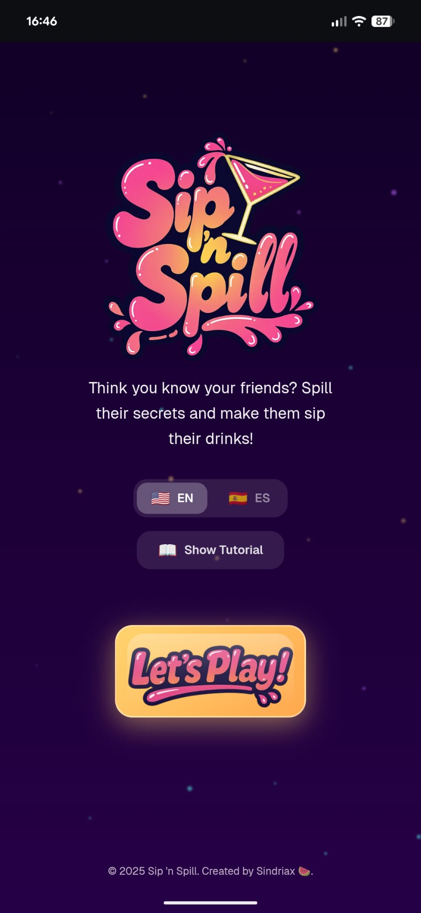
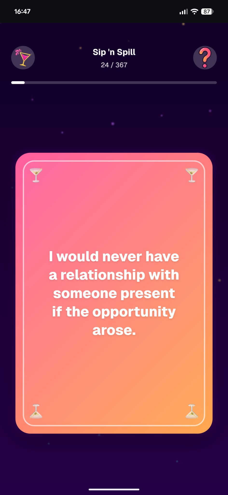

# Sip 'n Spill

A drinking game web app with a twist - instead of sharing your own secrets, you guess what your friends have done!

> **18+** | Please drink responsibly

## How to Play

1. **The Guesser** reads a question silently
2. **Make predictions** about each player - did they do it or not?
3. **Reveal** the question out loud
4. **Drink up!** - If you guessed right about someone, they drink. If you guessed wrong, you drink!

## Features

- 500+ questions across multiple categories
- **Chill Mode** - Safe for work, still fun
- **Spicy** - Classic party mode
- **Unhinged** - No limits, play at your own risk
- Bilingual support (English & Spanish)
- Interactive tutorial
- Mobile-first design

 ## Screenshots

  <table>
    <tr>
      <td align="center"><br><em>Home</em></td>
      <td align="center"><br><em>Gameplay</em></td>
    </tr>
  </table>

## Tech Stack

- Next.js 15
- TypeScript
- Tailwind CSS
- Framer Motion
- MongoDB

## Development

```bash
npm install
npm run dev
```

Open [http://localhost:3000](http://localhost:3000)

## Environment Variables

Create a `.env.local` file:

```
MONGODB_URI=your_mongodb_connection_string
```

## Seeding the Database

```bash
npx tsx src/scripts/seed-questions.ts
```

## Created by

[Sindriax](https://github.com/sindriax)
